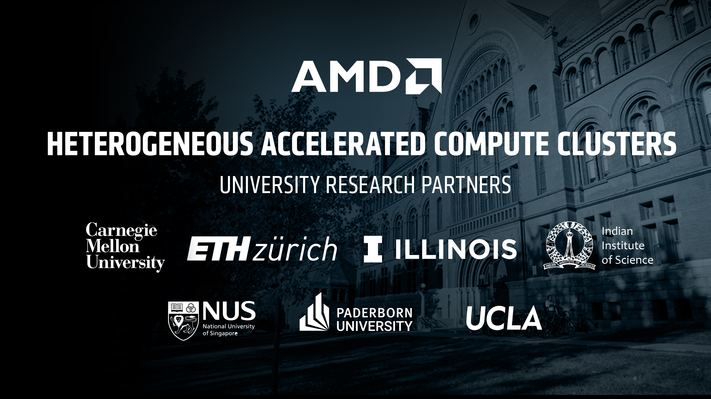

# Heterogeneous Accelerated Compute Clusters

View this repository on GitHub pages: [amd-haccs.io](https://www.amd-haccs.io/)

## Contribute to this site

To contribute visit [contributing](docs/contributing.md)

## Contact us

If you have any questions about the HACC program, please e-mail the AMD University Program <aup@amd.com>

---------------------------------------

Copyright&copy; 2022-2025 Advanced Micro Devices

