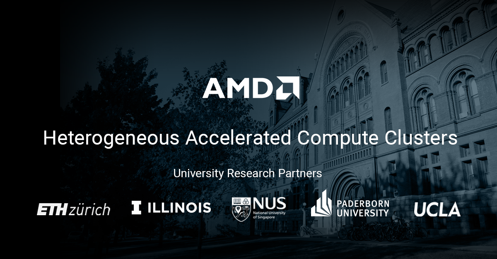

# Heterogeneous Accelerated Compute Clusters

The Heterogeneous Accelerated Compute Clusters (HACC) program is a special initiative to support novel research in adaptive compute acceleration for high performance computing (HPC). The scope of the program is broad and encompasses systems, architecture, tools and applications. 

Five HACCs have been established at some of world’s most prestigious universities. HACCs are equipped with the latest AMD Adaptive Computing hardware and software technologies. Each cluster is specially configured to enable some of the world’s foremost academic teams to conduct state-of-the-art HPC research.

See the [getting started](./get-started.html) page for more details on the program and how to apply.

## Contribute to this site

If you would like to contribute to this site by adding an HACC related publications, examples, demos, training materials or other resources, you can open a pull request via the GitHub link in the bottom left of this page, or you can [e-mail the AMD University Program](mailto:aup@amd.com) team who manage the HACC program.

For more information visit [contributing](contributing.md)

## Contact us

If you have any questions about the HACC program, please e-mail the AMD University Program <aup@amd.com>

---------------------------------------

Copyright&copy; 2022-2023 Advanced Micro Devices
