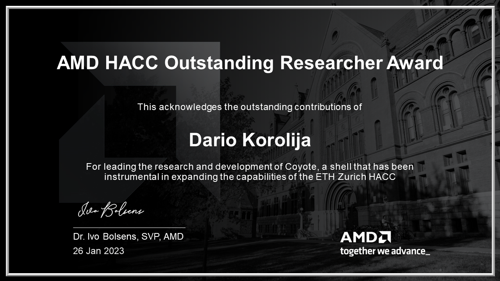
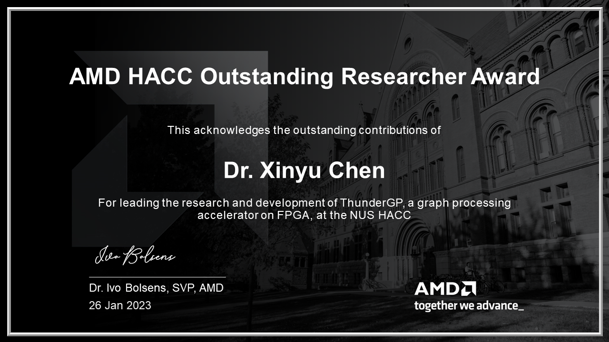
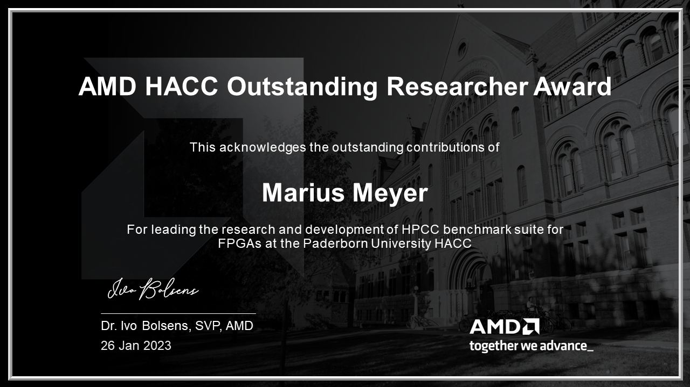
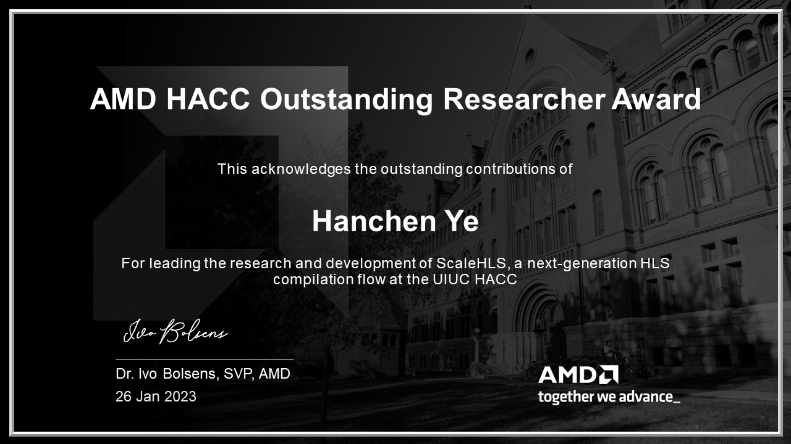

# Outstanding Researcher Awards​

## 2022

<!--Sorted alphabetically by center-->

<table border="0" width="100%" style="border: 0px; background:transparent">
    <thead>
        <tr style="border: 0px;">
            <td width="160" style="border: 0px; background:transparent; text-align: center; vertical-align: middle;">
                
            </td>
            <td width="160" style="border: 0px; background:transparent; text-align: center; vertical-align: middle;">
                
            </td>
            <td width="160" style="border: 0px; background:transparent; text-align: center; vertical-align: middle;">
                
            </td>
            <td width="160" style="border: 0px; background:transparent; text-align: center; vertical-align: middle;">
                
            </td>
            <td width="160" style="border: 0px; background:transparent; text-align: center; vertical-align: middle;">
                
            </td>
        </tr>        
        <tr style="border: 0px;">
            <td width="160" style="border: 0px; background:transparent; text-align: center; vertical-align: middle;"><strong>Dario Korolija</strong></td>
            <td width="160" style="border: 0px; background:transparent; text-align: center; vertical-align: middle;"><strong>Dr. Xinyu Chen</strong></td>
            <td width="160" style="border: 0px; background:transparent; text-align: center; vertical-align: middle;"><strong>Marius Meyer</strong></td>
            <td width="160" style="border: 0px; background:transparent; text-align: center; vertical-align: middle;"><strong>Licheng Guo</strong></td>
            <td width="160" style="border: 0px; background:transparent; text-align: center; vertical-align: middle;"><strong>Hanchen Ye​</strong></td>
        </tr>
        <tr style="border: 0px;">
            <td width="160" style="border: 0px; background:transparent; text-align: center; vertical-align: middle;">ETH Zurich</td>
            <td width="160" style="border: 0px; background:transparent; text-align: center; vertical-align: middle;">NUS</td>
            <td width="160" style="border: 0px; background:transparent; text-align: center; vertical-align: middle;">Paderborn University​</td>
            <td width="160" style="border: 0px; background:transparent; text-align: center; vertical-align: middle;">UCLA</td>
            <td width="160" style="border: 0px; background:transparent; text-align: center; vertical-align: middle;">UIUC</td>
        </tr>
    </thead>
</table>

---------------------------------------

Copyright&copy; 2022 Advanced Micro Devices
