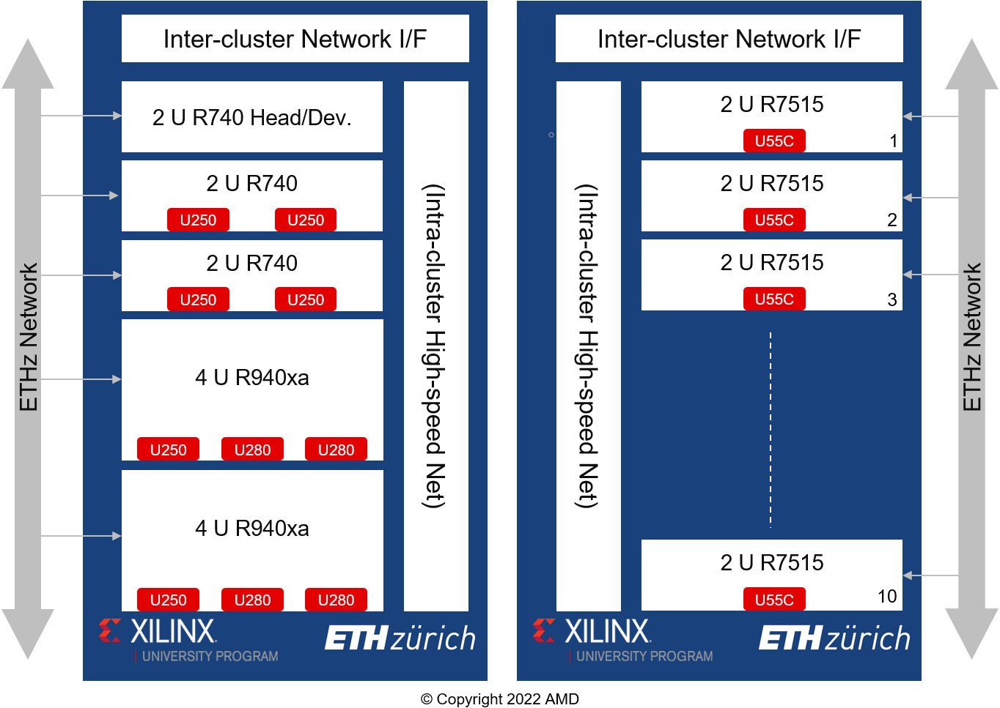

# ETH Zurich

The cluster at ETH Zurich provides the infrastructure to research in systems, architecture and applications.

The head of the ETH Zurich XACC is [Prof. Gustavo Alonso](https://inf.ethz.ch/people/person-detail.alonso.html) from the [Systems Group](https://systems.ethz.ch/) in the  Department of Computer Science at ETH Zurich.  

# Infrastructure

The ETH Zurich cluster consists of five servers one for development and four for deployment. Deployment servers host a mix of Alveo U250 and Alveo U280 as shown in the image below

In terms of networking communication, each Alveo cards has two 100 Gbps interfaces, one is connected to a switch and the another connected to its neighbor this is depicted in the image below

> Note: hardware and network configuration can change at any time

Once you are approved for the XACC program, details on how to access the ETH Zurich XACC and the other XACCs can be found on the [XACC members site](https://www.xilinx.com/member/xup_research_clusters.html).

For more information on the hardware configuration and software, see the [ETH Zurich XACC](https://systems.ethz.ch/research/data-processing-on-modern-hardware/alveo-fpga-cluster.html) webpage. 

---------------------------------------

Copyright&copy; 2021 Xilinx
