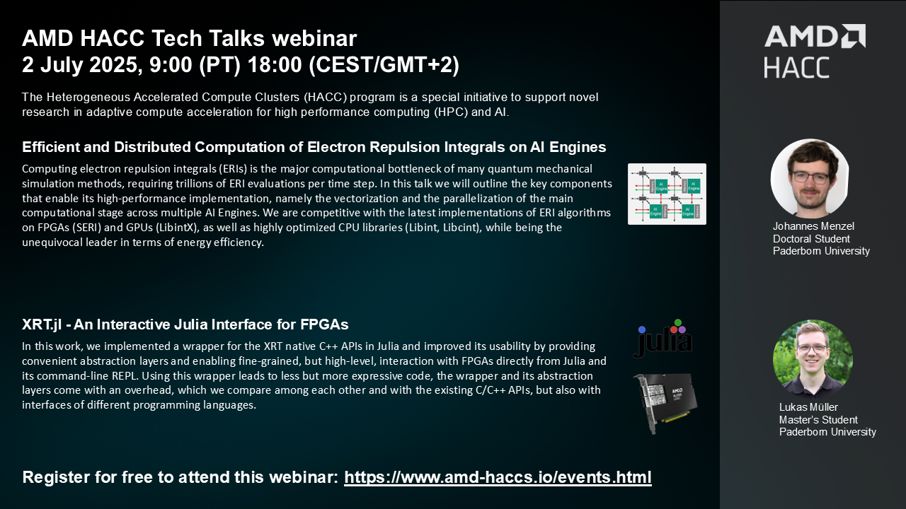

# Events

## HACC Tech Talks

The HACC Tech Talks are a series of webinars covering a broad range of topics related to AMD Adaptive Compute. Each session is 1 hour, with two 30-minute talks in each session.

### HACC Tech Talk 18

2 July 2025, 9:00-10:00 (PT) 18:00-19:00 (CEST/GMT+2)

[ Register now](https://amd.zoom.us/webinar/register/WN__KSxFLl7RUmAk1dWG_tuMg)

## Past Tech Talks

To watch previous tech-talks go to the <a href="./hacc_tech_talks.html#past-talks">HACC Tech Talk Page</a>

## Past Events

<table class="responsive">
  <tr>
    <td>
      <strong> Xilinx Adaptive Compute Clusters (XACC) </strong> Academia-Industry Research Ecosystem in September 7th 2021
    </td>
    <td>
      <a href="adapt_2021.html">More Information</a>
    </td>
  </tr>
  <tr>
    <td width="800">
      <strong>ETH Zurich XACC school: </strong>Xilinx University Program XACC School in January 2021
    </td>
    <td width="200">
      <a href="xup_ethxacc_school_2021.html">More information</a>
    </td>
  </tr>
  <tr>
    <td>
      <strong>NUS: </strong>XACC @NUS workshop series 2020
    </td>
    <td>
      <a href="https://xaccnus.github.io/">More information</a>
    </td>
  </tr>
</table>

---------------------------------------

Copyright&copy; 2022 Advanced Micro Devices

