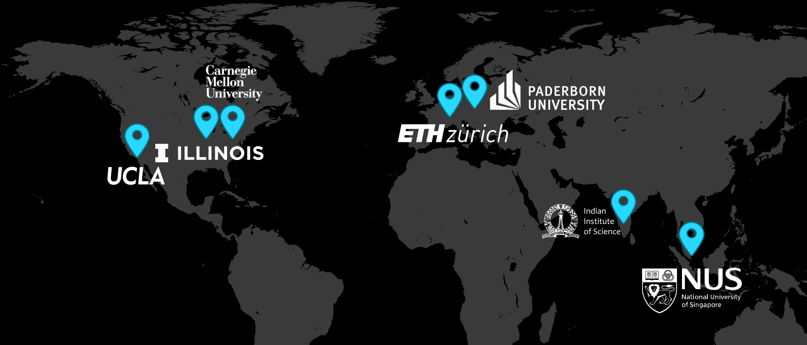

# Get Started

Researchers from academic and industry are invited to apply to the HACC program by [registering for the Heterogeneous Accelerated Compute Cluster program](https://account.amd.com/en/member/aup_research_clusters.html)

Priority research areas for the HACCs include:

* Adaptive compute acceleration
* High performance computing (HPC)
* Machine Learning
* Database acceleration
* Energy efficiency
* Compilers
* IOT
* Computer architecture

## HACCs

There are six HACCs centers located at [ETH Zurich](ethz.md) in Switzerland, [Indian Institute of Science (IISc),](iisc.md) in India, [National University of Singapore (NUS)](nus.md) in Singapore, [Paderborn University](paderborn.md) in Germany, [University of California, Los Angeles (UCLA)](ucla.md) in the US, and the [University of Illinois at Urbana Champagne (UIUC)](uiuc.md) in the US.

You can apply to the HACC program, and once approved, you can then get access to one or more HACCs. There are some local differences between the hardware configurations at each site. Check the page for the corresponding HACC for details. HACCs are experimental systems.  The system configurations may change over time, and configuration changes or special use cases can be requested by contacting the HACC program.

## Members site

The HACC program currently has over 500 members from more than 150 institutions around the world.

Approved members will get access to the [HACC members site](https://account.amd.com/en/member/aup_research_clusters.html) which contains instructions for getting started and reserving machines in the different HACCs.

---------------------------------------

Copyright&copy; 2022-2024 Advanced Micro Devices

