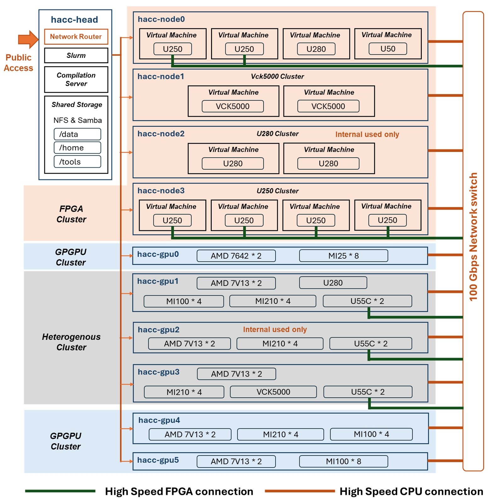

# National University of Singapore

The cluster at NUS will boost new systems and applications research and development with heterogeneous computing platforms. It will also become a hub for attracting researchers and students from Asia to promote international collaborations as well as for establishing a global test-bed with the other HACC centers in Asia, Europe and the United States.
The research is led by Professor [He Bingsheng](https://www.comp.nus.edu.sg/cs/bio/hebs/), Associate Professor [Wong Weng-Fai](https://www.comp.nus.edu.sg/cs/bio/wongwf/) and Professor [Tulika Mitra](https://www.comp.nus.edu.sg/cs/bio/tulika/) from the Department of Computer Science at the NUS School of Computing. Professor He serves as Chair of the Joint Academic Committee of Computer Engineering Program and Vice Dean (by research) at the school.

------------
The cluster is composed by ten nodes, each of them with unique capabilities to support a range of computing needs. HACC@NUS cluster includes a head node with large storage capacity, four FPGA nodes each with Alveo FPGA boards, three GPU nodes with high-performance AMD GPUs, and three heterogeneous nodes equipped with AMD CPUs, GPUs, and FPGAs.
The hardware topology is shown in below.

**Cluster configuration**

For more details and latest update, see the HACC@NUS [website](https://hacc.xtra.science)

---------------------------------------

Copyright&copy; 2022 Advanced Micro Devices

