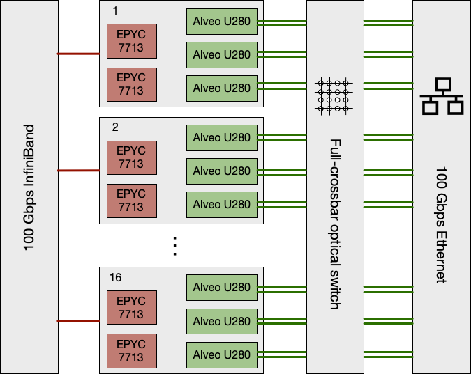
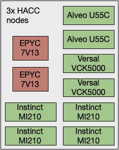

# Paderborn University

The Heterogeneous Accelerated Compute Cluster at the [Paderborn Center for Parallel Computing](https://pc2.uni-paderborn.de) (PC2) is led by principal investigator [Prof. Christian Plessl](https://en.cs.uni-paderborn.de/hpc/team/plessl), who is the director of PC2 and holds the chair for High-Performance Computing at the Department of Computer Science at [Paderborn University, Germany](https://www.uni-paderborn.de/en). [Prof. Marco Platzner](https://en.cs.uni-paderborn.de/ceg/team/group/people/marco-platzner), who holds the [Chair for Computer Engineering](https://en.cs.uni-paderborn.de/ceg) and is also a member of PC2, serves as co-PI for the HACC at Paderborn University.

As a national HPC center, PC2 provides computing resources, consulting and services for academic users throughout Germany. A key part of the scientific mission of PC2 is research in highly scalable and energy-efficient numerical methods and simulation techniques, targeting HPC systems with heterogeneous computing resources. Specifically, PC2 has long-standing experience with and a pioneering role in moving FPGAs from the testbed to real HPC systems and operates some of the largest and most modern HPC production systems with FPGA accelerators.

The specific role of PC2 in the HACC program is to contribute its dual expertise in HPC and FPGA acceleration and to pursue the development of FPGA-accelerated libraries for scientific computing, domain-specific toolflows for the design of FPGA accelerators and ready to use open source HPC codes with FPGA support.

As part of the HACC program, PC2 makes the Noctua 2 system available to qualified researchers worldwide for technology evaluation and joint development of tools and applications.

## The Noctua 2 HPC System with FPGAs

Noctua 2 is an Atos BullSequana XH2000 heterogeneous computing platform with

* a CPU partition with 1,056 dual-socket servers populated with AMD Milan 7763 CPUs, for a total of 135,168 CPU cores,
* a GPU partition with 32 nodes and a total of 128 Nvidia A100 GPUs,
* an FPGA partition with 36 nodes, 48 AMD Alveo U280 accelerator cards, each equipped with 8 Gbytes of HBM2 and 32 Gbytes of DDR4 memory, and 32 BittWare 520N FPGA accelerator cards, and
* a HACC partition with three heterogeneous nodes, each equipped with two AMD Alveo U55C cards, two AMD Versal VCK5000 cards and four AMD Instinct MI200 GPUs.

### FPGA Partition (for general HPC usage and HACC users)

All nodes in Noctua 2 are connected by a 100 Gbps InfiniBand network. Additionally, all FPGA cards are connected to a Calient S320 full-crossbar, optical layer-1 circuit switch that provides a configurable optical network dedicated to direct FPGA-to-FPGA communication. Finally, a 100 Gbps Ethernet switch, which can be reached from each port on the FPGA cards via the optical switch, is available for layer-2 or layer-3 networking.

### HACC Partition

The three HACC nodes are fully integrated into Noctua 2 and connected to the same 100 Gbps InfiniBand network. They can be accessed as part of the regular production environment.

---------------------------------------

Copyright&copy; 2022-2024 Advanced Micro Devices

