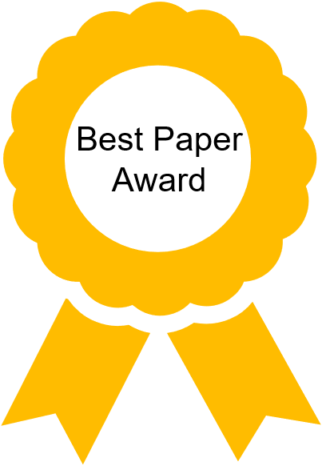

# Publications

This page lists the research publications which have been carried out in the context of the HACC program, or papers that may be of interest to the HACC community.

## Contribute

If you would like to contribute to this page by adding a reference to your publication, please follow the [contribution guidelines](contributing.md)

<!--
DO NOT MODIFY THIS FILE.

TO ADD YOUR PAPER, PLEASE EDIT THE YAML FILE IN docs/_data/publications/<year of publication>.yaml
-->



Click in the year for easier search:



- [{{ year }}](#{{ year }})





## {{ year }}

<table width="100%">
    <tr>
        <th width="200">Name</th>
        <th width="120">Author(s)</th>
        <th width="120">Institution</th>
        <th width="120">Link</th>
        <th width="500">Notes</th>
    </tr>

    
    <tr>
        <td>
            {{ item.title }}
            
                
            
        </td>
        <td>{{ item.author }}<em>et al.</em></td>
        <td>{{ item.institution }}</td>
        <td>
            <a href="{{ item.link }}">Paper</a>
            
                 <a href="{{ item.github }}">GitHub</a>
            
        </td>
        <td>
            {{ item.abstract }}
        </td>
    </tr>
    
</table>



---------------------------------------

Copyright&copy; 2022-2024 Advanced Micro Devices

